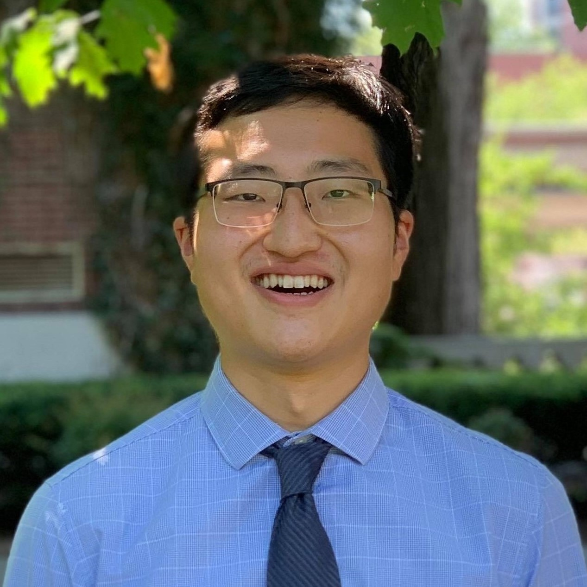

   

---

MD/PhD student at the University of Rochester

Research interests: chemical biology, drug discovery, molecular imaging

Previously: BA in chemistry, minor in bioengineering from UC Berkeley; Flavell Lab at UCSF
